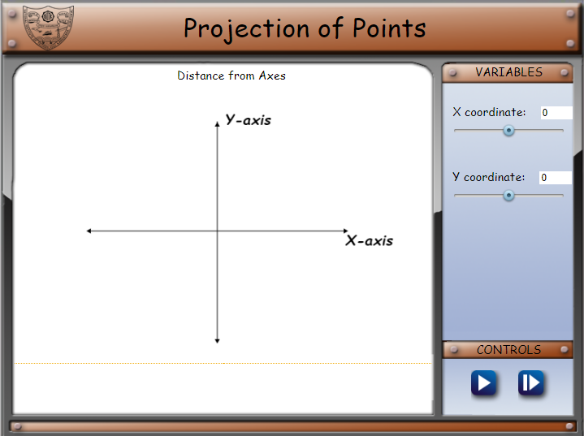
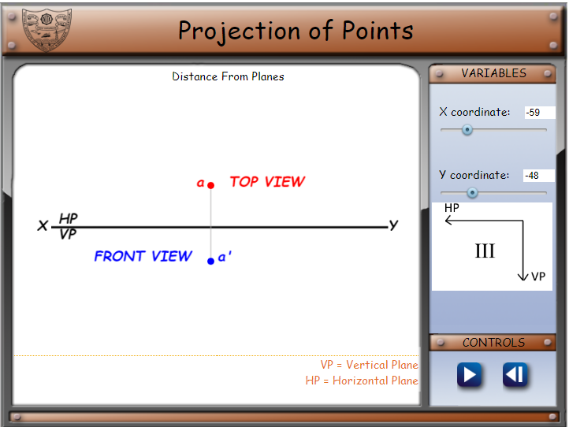
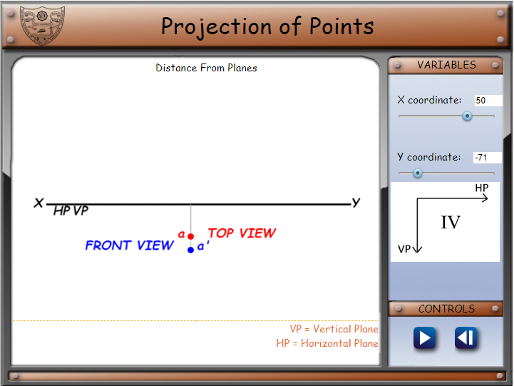

1.  .**Open the simulation**, the screen will display a cartesian plane **with a
    control panel** on it.

2.  .Then **set the X and Y- coordinates of the point** from the panel. **Click
    on the button on the left** for the exact position of a point in the
    cartesian plane along with 3D orientation.

3.  .**Click on the button on the right** for the next step

Here the simulation step ends and **for the previous step click on the button on
the right**.
