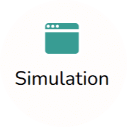
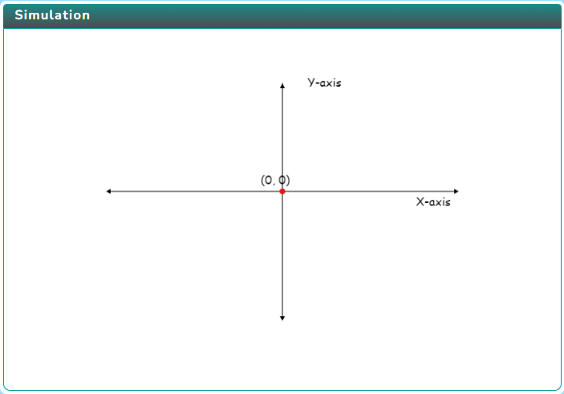
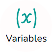
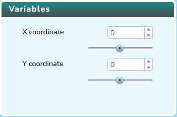
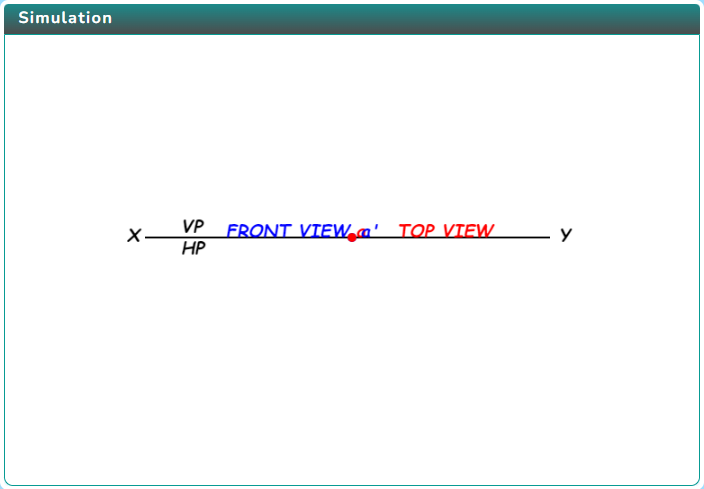

### Procedure

  Click on the Simulation icon   to view the simulation. 

   
   
   In order to view the variable section click on the Variable icon. 

   

   
 
   Click on the Next icon   to cycle through different pages.  

   

